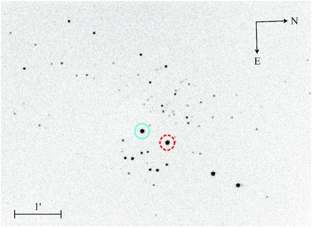

.. include:: ../references.txt

Polarimetry Processing
======================

|astropop| polarimetry computation currently is desgined to work only with dual-beam polarimeters with half-wave plate (HWP) and quarter-wave plate (QWP) retarders, performing both circular and linear polarization computations, according the instrument capabilities and design. Savart or Wollaston analyzers are supported. For example of instruments that can be used with astropop, we already tested with success the following instruments:

* IAGPOL [1]_ - Gaveta Polarimétrica do IAG `link <http://astroweb.iag.usp.br/~polarimetria/gaveta/default.htm>`_ at Observatório Pico dos Dias, Brazil
* SPARC4 [2]_ - Simultaneous Polarimeter and Rapid Camera in Four bands `link <http://www.das.inpe.br/sparc4>`_ at Observatório Pico dos Dias, Brazil
* LE2POL [3]_ - Leicester dual-beam imaging polarimeter at University of Leicester, UK
* FORS2 - FORS2, FOcal Reducer/low dispersion Spectrograph 2 at ESO, Chile, in IPOL mode. `link <https://www.eso.org/sci/facilities/paranal/instruments/fors/overview.html>`_
* POLIMA2 - Optical Dual-Beam Polarizer at OAN-SPM, Mexico. `link <https://www.astrossp.unam.mx/en/users/instruments/ccd-imaging/polima-2>`_

In all this polarimeters, the light beam passed by a retarder and is decomposed in two, ortogonal polarized, beams. So, the ordinary and extraordinary beams produce separated images and all the stars can appear duplicated in the detector. For example, see the image bellow taken from [3]_. |astropop| is designed to handle this kind of data.



   LE2POL image, where all stars are duplicated. So, each star produces one image for each ordinary and extraordinary beams. The image is from [3]_.

Description of the Polarimetry Reduction
----------------------------------------

The reduction process overview is derived from the work of Magalhães et al. [1]_ and Rodrigues et al. [4]_ , using a fitting process better described by Campagnolo (2019) [5]_. In a few words, the code computes the normalized flux difference between the ordinary and extraordinary beams ($F_{e}$ and $F_{o}$) for each retarder plate position:

.. math::

    Z_{i} = \frac{F_{e} - F_{o}}{F_{e} + F_{o}}

And fits a equation for a given set o positions. There are two equations that can be used:

* For half-wave plates, only linear polarization is computed, and the equation is:

  .. math::

    Z_i = Q \cos{4 \psi_i} + U \sin{4 \psi_i}

  .. plot::
    :include-source: False

    import numpy as np
    import matplotlib.pyplot as plt
    from astropop.polarimetry import halfwave_model

    psi_lin = np.linspace(0, 360, 600)
    psi_i = np.arange(0, 361, 22.5)
    z_i = halfwave_model(psi_i, 0.12, -0.07)
    z_lin = halfwave_model(psi_lin, 0.12, -0.07)

    plt.figure(figsize=(5, 3))
    plt.plot(psi_lin, z_lin, '-', label='Model')
    plt.plot(psi_i, z_i, 'o', label='Data Points')
    plt.xlabel(r'$\psi_i$')
    plt.ylabel(r'$Z_i$')
    plt.title('Example of half-wave plate\nQ=0.12, U=-0.07')
    plt.legend()
    plt.tight_layout()
    plt.show()

* For quarter-wave plates, linear and circular polarization is computed, and the equation is:

  .. math::

    Z_i = Q \cos^2{2 \psi_i} + U \sin{2 \psi_i} \cos{2 \psi_i} - V \sin{2 \psi_i}

  .. plot::
    :include-source: False

    import numpy as np
    import matplotlib.pyplot as plt
    from astropop.polarimetry import quarterwave_model

    psi_lin = np.linspace(0, 360, 600)
    psi_i = np.arange(0, 361, 22.5)
    z_i = quarterwave_model(psi_i, 0.05, -0.07, 0.08)
    z_lin = quarterwave_model(psi_lin, 0.05, -0.07, 0.08)

    plt.figure(figsize=(5, 3))
    plt.plot(psi_lin, z_lin, '-', label='Model')
    plt.plot(psi_i, z_i, 'o', label='Data Points')
    plt.xlabel(r'$\psi_i$')
    plt.ylabel(r'$Z_i$')
    plt.legend()
    plt.title('Example of quarter-wave plate\nQ=0.05, U=-0.07, V=0.08')
    plt.tight_layout()
    plt.show()

Where :math:`Q`, :math:`U` and :math:`V` are the linear and circular polarization fractions and $\psi_i$ is the retarder plate position.

Normalization
^^^^^^^^^^^^^

If the instrument have different sensibility for each beam or if the PSF of the two beams do not match (a common thing in Savart analyzers), a normalization :math:`k` factor must be included in the equation of the relative flux ($Z_i$). This normalization factor scales one of the beams to compensate the difference in sensibility. So, the flux difference equation becomes:

.. math::

    Z_{i} = \frac{F_{e} - F_{o} \cdot k}{F_{e} + F_{o} \cdot k}

This :math:`k` factor is computed in different ways for half-wave and quarter-wave plates.

* For half-wave plates, :math:`k` is computed as the ratio between the sum of the extraordinary and ordinary fluxes along a complete set of 4 consecutive retarder positions (0, 22.5, 45 and 67.5 degrees). The explanation is better described in [1]_. This is possible because the equation for half-wave plates is symmetrical in 0. So:

  .. math::

    k = \frac{\sum_{i=1}^{4} F_{e, i}}{\sum_{i=1}^{4} F_{o, i}}

* For quarter-wave plates, the term :math:`Q\cos^2{2 \psi_i}` in the equation is always positive, so the results are not symmetrical in 0. Due to this, the equation above cannot be used to compute :math:`k`. Rodrigues (1998) [4]_ and Lima (2021) [6]_ describe a iterative process, where :math:`k` depends on :math:`Q`. According this process, the Stokes parameters are computed with some :math:`k`, and then a new :math:`k` is computed using the new Stokes parameters. This process is repeated until the computed Stokes parameters converge within a given tolerance.

Both methods are implemented in |astropop|.

Angle Zero of the Retarder
^^^^^^^^^^^^^^^^^^^^^^^^^^

It is expected that the angle zero of the retarder plate do not match perfectly with the analyzer and the equatorial system of the sky. Due to this, the observation of standard stars may be needed to compute the correction to be applied to fix the instrumental computed position angle and the real position angle of the sky. As this is a standard, post-reduction, data processing step, we will not go deep into this topic here. An offset zero do not affect the results for linear polarization in half-wave plates.

However, for circular polarization, the zero offset is important due to the assymmetry of the equation. So, with this configuration, there is an additional offset to be computed within the Stokes computation process. This instrumental offset, if wrong, leads to wrong results and with high errors. Additionally, the best wy to compute it is by reducing data from a star with strong circular polarization level. Once this offset is determined, it can be used in other reductions, since it is commonly a instrument-dependent value.

Polarimetry Reduction in |astropop|
-----------------------------------

There are 2 main steps in the polarimetry reduction process: the pairs matching and the Stokes parameters computation.

To compute the Stokes parameters of a given source, |astropop| uses arrays of fluxes and retarder positions. So, it is not directly dependent on the photometry routines to process the data and you can use your own already extracted photometry for this process. Also, our helper functions to match the pairs of ordinary and extraordinary beams also use just arrays of x and y positions, and are not dependent on the photometry routines too. So, **no part of the polarimetry reduction depend on the use of |astropop| for source extraction and photometry and you can use your own data or code in this process**.

For example, in this documentation we will use totally fake photometry and random pairs positions to illustrate the polarimetry reduction process.

Stokes-Least-Squares Polarimetry Processing
^^^^^^^^^^^^^^^^^^^^^^^^^^^^^^^^^^^^^^^^^^^

The Stokes-Least-Squares (SLS) method is a method to compute the Stokes parameters by fitting the modulation equations described above to the relative flux difference of the data using a least-squares method with Trust Region Reflective algorithm. For a better description and validation of this method, see [5]_.

First of all, lets create the fake data to be used here for example.

.. ipython:: python

  import numpy as np
  from astropop.polarimetry import halfwave_model, quarterwave_model
  flux = 1e7  # total flux of the source, in electrons
  # retarder positions, in degrees
  psi_i = np.arange(0, 360, 22.5)

  # half-wave plate with only linear polarization
  # q=0.05, u=-0.07
  z_i_half = halfwave_model(psi_i, 0.05, -0.07)
  z_i_half = np.random.normal(loc=z_i_half, scale=0.005)  # add some noise
  fo_half = flux*(1+z_i_half)/2  # ordinary beam fluxes
  fe_half = flux*(1-z_i_half)/2  # extraordinary beam fluxes

  # quarter-wave plate with linear and circular polarization
  # q=0.05, u=-0.07, v=0.08
  z_i_quarter = quarterwave_model(psi_i, 0.05, -0.07, 0.08)
  z_i_quarter = np.random.normal(loc=z_i_quarter, scale=0.005)  # add some noise
  fo_quarter = flux*(1+z_i_quarter)/2  # ordinary beam fluxes
  fe_quarter = flux*(1-z_i_quarter)/2  # extraordinary beam fluxes


.. plot::
  :include-source: False
  :caption: Simulated data for the Stokes-Least-Squares polarimetry processing.

  import numpy as np
  from astropop.polarimetry import halfwave_model, quarterwave_model
  flux = 1e7  # total flux of the source, in electrons
  # retarder positions, in degrees
  psi_i = np.arange(0, 360, 22.5)
  lin = np.linspace(0, 360, 360)

  fig, ax = plt.subplots(2, 2, figsize=(8, 6), sharex=True, sharey='row')

  # half-wave plate with only linear polarization
  # q=0.05, u=-0.07
  params_h = (0.05, -0.07)
  z_i_half = halfwave_model(psi_i, *params_h)
  z_i_half = np.random.normal(loc=z_i_half, scale=0.005)
  fo_half = flux*(1+z_i_half)/2  # ordinary beam fluxes
  fe_half = flux*(1-z_i_half)/2  # extraordinary beam fluxes
  lin_e_half = flux*(1-halfwave_model(lin, *params_h))/2
  lin_o_half = flux*(1+halfwave_model(lin, *params_h))/2

  ax[0][0].plot(psi_i, fo_half, 'C0o', label='Ordinary')
  ax[0][0].plot(psi_i, fe_half, 'C1o', label='Extraordinary')
  ax[0][0].plot(lin, lin_o_half, 'C0--')
  ax[0][0].plot(lin, lin_e_half, 'C1--')
  ax[0][0].legend()
  ax[0][0].set_title('Half-wave plate\nQ=0.05, U=-0.07')
  ax[0][0].set_ylabel('Flux (e-)')

  ax[1][0].plot(psi_i, z_i_half, 'C2o')
  ax[1][0].plot(lin, halfwave_model(lin, 0.05, -0.07), 'C2--')
  ax[1][0].set_ylabel(r'Relative flux difference ($Z_i$)')
  ax[1][0].set_xlabel(r'Retarder position $\psi_i$ in (deg)')

  # quarter-wave plate with linear and circular polarization
  # q=0.05, u=-0.07, v=0.08
  params_q = (0.05, -0.07, 0.08)
  z_i_quarter = quarterwave_model(psi_i, *params_q)
  z_i_quarter = np.random.normal(loc=z_i_quarter, scale=0.005)
  fo_quarter = flux*(1+z_i_quarter)/2  # ordinary beam fluxes
  fe_quarter = flux*(1-z_i_quarter)/2  # extraordinary beam fluxes
  lin_e_quarter = flux*(1-quarterwave_model(lin, *params_q))/2
  lin_o_quarter = flux*(1+quarterwave_model(lin, *params_q))/2

  ax[0][1].plot(psi_i, fo_quarter, 'C0o', label='Ordinary')
  ax[0][1].plot(psi_i, fe_quarter, 'C1o', label='Extraordinary')
  ax[0][1].plot(lin, lin_o_quarter, 'C0--')
  ax[0][1].plot(lin, lin_e_quarter, 'C1--')
  ax[0][1].legend()
  ax[0][1].set_title('Quarter-wave plate\nQ=0.05, U=-0.07, V=0.08')

  ax[1][1].plot(psi_i, z_i_quarter, 'C2o')
  ax[1][1].plot(lin, quarterwave_model(lin, *params_q), 'C2--')
  ax[1][1].set_xlabel(r'Retarder position $\psi_i$ in (deg)')

  ax[1][0].set_xticks(np.arange(0, 361, 45))
  ax[1][0].set_xlim(0, 360)

  fig.tight_layout()
  plt.show()

Create an `~astropop.polarimetry.SLSDualBeamPolarimetry`
^^^^^^^^^^^^^^^^^^^^^^^^^^^^^^^^^^^^^^^^^^^^^^^^^^^^^^^^

The Stokes parameters computation is entirely done by the
`~astropop.polarimetry.SLSDualBeamPolarimetry` class. This class stores some configuration parameters and process a given set of data using the `~astropop.polarimetry.SLSDualBeamPolarimetry.compute` method. During the instance creation you must choose the type of the retarder used in the observations, between ``halfwave`` and ``quarterwave`` options. Aditional arguments can be passed, like normaliation computation, zero position of retarder, and others. Check the class documentation for more information.

First, you must create a `~astropop.polarimetry.SLSDualBeamPolarimetry` instance with your options. Here are some examples:

.. ipython:: python

  from astropop.polarimetry import SLSDualBeamPolarimetry
  # half-wave plate
  s = SLSDualBeamPolarimetry('halfwave')
  # quarter-wave plate
  s = SLSDualBeamPolarimetry('quarterwave')
  # half-wave plate and tell the class to compute the k parameter
  s = SLSDualBeamPolarimetry('halfwave', compute_k=True)
  # quarter-wave plate with normalization and zero position at 45 degrees
  s = SLSDualBeamPolarimetry('quarterwave', compute_k=True, zero=45)

* For normalization, there is two (incompatible) arguments: ``compute_k`` and ``k``. When using ``k=value``, you are setting a fixed value for the normalization constant, so, it will not be computed by the code. For example, if you set ``k=1.05``, it will use this factor in the nromalization. for ``compute_k=True``, the normalization constant will be computed by the code. In general, all instruments we tested have this :math:`k` value very close to 1.0, but using normalization may improve some cases.

* For the zero computation, you can choose between a fixed value of zero, using ``zero=value`` in degrees. So, setting ``zero=30.2`` will force the code to use 30.2° as the zero point of the retarder. When the zero is not specified, there are two behaviors you can expect:
  - for ``halfwave`` retarders, the code will use 0.0 as the zero position, sice it is not possible to compute it from the data.
  - for ```quarterwave``` retarders, the code will try to fit the zero together with the Stokes parameters. The code will seek the value the zero inside the limits defined by ``zero_range`` argument. So, if you want the code to find a zero between 0 and 45 degrees, you can set ``zero_range=(0, 45)``. By default, the code will use ``zero_range=(0, 90)``.

.. note::

  - It is important to mention that ``quarterwave`` retarders find the zero position better when circular polarization is present. So, it is recommended that you use a circular polarized star to compute the zero of the instrument and use it for the other stars in the observation.
  - **For stars that only have linear polarization, the code can compute the zero only if compute_k is set to False.** This happens because the ``zero`` and ``k`` parameters are degenerated in ``quarterwave`` retarders due to the :math:`Q\cos^2{2 \psi_i}`. So, using ``compute_k=True`` and ``zero=None`` will not converge to a solution in this case. For stars with circuar polarimetry, these arguments can be used together and the code will be able to find the zero position and the normalization constant at the same time.

* The iteration process is controlled by 2 arguments: ``iter_tolerance`` and ``max_iters``. ``iter_tolerance`` sets the limit between runs where the code assumes the solution is converged. Like, if the difference between the Stokes parameters of the last two runs is less than ``iter_tolerance``, the code will stop. The ``max_iters`` sets the maximum number of iterations the code will run. By default, ``iter_tolerance=1e-5`` and ``max_iters=100``, which give very good results and are enough for most cases.

Stokes Parameters Computation
^^^^^^^^^^^^^^^^^^^^^^^^^^^^^

The `~astropop.polarimetry.SLSDualBeamPolarimetry.compute` method is the method to be used to compute the Stokes parameters from the flux data. It recieves the list of retarder positions (in degrees) and the lists of ordinary and extraordinary fluxes for a source in each retarder position. Optionally, you can pass the lists of errors in the fluxes, that will be used to weight the least squares fit.

For example, computing the Stokes parameters for the half-wave plate data without errors:

.. ipython:: python
  :okwarning:

  s = SLSDualBeamPolarimetry('halfwave')
  result = s.compute(psi_i, fo_half, fe_half)
  print(result)

And with errors:

.. ipython:: python
  :okwarning:

  s = SLSDualBeamPolarimetry('quarterwave', zero=0)
  # let's assume the errors are the square root of the fluxes
  fo_quarter_err = np.sqrt(fo_quarter)
  fe_quarter_err = np.sqrt(fe_quarter)
  result = s.compute(psi_i, fo_quarter, fe_quarter,
                     fo_quarter_err, fe_quarter_err)
  print(result)

`~astropop.polarimetry.StokesParameters` class
^^^^^^^^^^^^^^^^^^^^^^^^^^^^^^^^^^^^^^^^^^^^^^

The result of `~astropop.polarimetry.SLSDualBeamPolarimetry.compute` is a `~astropop.polarimetry.StokesParameters` instance. This class is just a container that stores relevant parameters of the computation. Both final Stokes parameters (:math:`Q`, `U` and `V`) and intermediate data, like :math:`\psi_i` retarder positions, :math:`Z_i` relative diference of fluxes, zero position and total flux in each position. It also compute some important properties, like position angle of linear polarization :math:`\theta`, linear polarization degree :math:`P` and theoretical error in Stokes parameters. Most of the properties are stored as |QFloat| containers.

The stored parameters are:

.. ipython:: python
  :okwarning:

  print(f'q={result.q}')
  print(f'u={result.u}')
  print(f'v={result.v}')
  print(f'k={result.k}')
  print(f'psi={result.psi}')
  print(f'z_i={result.zi}')
  print(f'zero={result.zero}')
  print(f'flux={result.flux}')

The linear polarization level is obtained from :math:`P=\sqrt{Q^2+U^2}` and is accessed by `~astropop.polarimetry.StokesParameters.p` property:

.. ipython:: python
  :okwarning:

  result.p

The position angle of linear polarization is obtained from :math:`\theta=\frac{1}{2}\tan^{-1}\left(\frac{U}{Q}\right)` and is accessed by `~astropop.polarimetry.StokesParameters.theta` property:

.. ipython:: python
  :okwarning:

  result.theta

The RMS between the model using computed parameters and the :math:`Z_i` values stored can be accessed directly by `~astropop.polarimetry.StokesParameters.rms` property. It is only available if ``zi`` is stored in the class.

.. ipython:: python
  :okwarning:

  result.rms

A theoretical expected error based on the fluxes SNR can be also computed by `~astropop.polarimetry.StokesParameters` using `~astropop.polarimetry.StokesParameters.theor_sigma` method. It is only available if ``flux`` is stored in the class.

.. ipython:: python
  :okwarning:

  result.theor_sigma

The computation of this theoretical error is not trivial. For `halfwave` retarders it is:

.. math::

  \sigma_P = \sigma_Q = \sigma_U = \frac{\sqrt{2}}{SNR}

and for `quarterwave` retarders it is:

.. math::

  \sigma_Q = \frac{1}{\sqrt{0.396} \cdot SNR}

.. math::

  \sigma_U = \frac{1}{\sqrt{0.1464} \cdot SNR}

.. math::

  \sigma_V = \frac{1}{\sqrt{0.4571} \cdot SNR}

.. math::

  \sigma_P = \frac{\sqrt{Q^2 \cdot \sigma_Q^2 + U^2\sigma_U^2}}{P}

Also, a callable model with fixed Stokes parameters can be generated by `~astropop.polarimetry.StokesParameters.model` method. Useful for plotting or data/fitting comparison. The only argument of the callable model is the ``psi`` retarder position.

.. ipython:: python
  :okwarning:

  plt.figure(figsize=(6, 4));
  plt.errorbar(result.psi.nominal, result.zi.nominal,
               yerr=result.zi.std_dev, fmt='o', label='data');
  line = np.linspace(0, 360, 300);
  model = result.model(line*result.psi.unit).nominal
  plt.plot(line, model, '--', label='model');
  plt.xlabel(r'$\psi$');
  plt.ylabel(r'$Z_i$');
  plt.title('Example of data and the callabel model comparison');
  plt.legend();
  plt.tight_layout();
  @savefig stokes_parameters.png
  plt.show()


Helper Tools
------------

As seen above, the dual-beam polarimeters produce images where all sources appear duplicated, due to ordinary and extraordinary beams presence. So, how can we separate the two beams? How to match the pairs to correctly process the polarimetry?

The `~astropop.polarimetry` module has some helper tools to help with this task. The `~astropop.polarimetry.estimate_dxdy` that computes the displacement, in pixels, between the ordinary and extraordinary beams and the `~astropop.polarimetry.match_pairs` function that match the pairs of sources in the image, based on a given displacement.

.. ipython:: python
  :okwarning:

  # random positions for the pairs
  # 80 pairs of sources in a image of 1024x1024 pixels
  # dx=25, dy=35
  x = np.random.uniform(0, 1024, 80)
  x = np.concatenate((x, x+25))  # x positions of the rouces
  y = np.random.uniform(0, 1024, 80)
  y = np.concatenate((y, y+35))  # y positions of the rouces

  # plot the sources
  plt.figure(figsize=(6, 6));
  plt.plot(x, y, 'ko', ms=5);
  @savefig pairs.png
  plt.title('Example of the pairs of sources');

Displacement Computation
^^^^^^^^^^^^^^^^^^^^^^^^

To find the displacement in :math:`x` and :math:`y` directions (:math:`dx` and :math:`dy`), the `~astropop.polarimetry.estimate_dxdy` uses a iterative clipped histogram around the mode of the distribution.

The code compute the distance of eache combination of two sources in the image, considering only the stars where :math:`y_i > y_j`, where :math:`y_i` and :math:`y_j` are the :math:`y` positions of the first and the second sources in the pair, respectively. This filtering eliminates reduncaties in the histogram of positive and negative values. Also, only pairs of stars closer than a ``dist_limit`` in each axes are considered.

After, the histogram is computed and the mode is estimated using the maximum value in this histogram. Than the histogram is clipped around this mode, and a new mode is estimated from a new, rebined, histogram. This iterative process repeats for all ``steps`` set for the function. For example, setting ``steps=[50, 5, 3, 1]``, the histogram will clipped in 50 pixels around the mode in the first iteration, 5 pixels in the second, 3 pixels in the third and 1 pixel in the last iteration. The number of ``bins`` of the histogram also interferes in the final result.

For example, let's estimate the displacement between the ordinary and extraordinary beams of our fake sources.

.. ipython:: python
  :okwarning:

  from astropop.polarimetry import estimate_dxdy

  dx, dy = estimate_dxdy(x, y, dist_limit=50, steps=[50, 5, 3, 1], bins=100)
  print(f'dx = {dx:.2f} pixels')
  print(f'dy = {dy:.2f} pixels')

The result of :math:`dx \approx 25` pixels and :math:`dy \approx 35` pixels is the expected for the fake sources, since they where used to generate the coordinates. The final precision, in general, depends on the error of the positions of the sources, the number of beams and the size of the clipping in the final step.

Pairs Matching
^^^^^^^^^^^^^^

Once you have a good value for the displacement, that is instrument-deppendent and may not need to be computed everytime, you can use the `~astropop.polarimetry.match_pairs` function to match the pairs of ordinary and extraordinary sources in the image.

This function uses `~scipy.spatial.cKDTree` to find the nearest neighbors of the ordinary sources in the extraordinary sources. The ``tolerance`` defines the maximum distance limit, in pixels, to consider a matching.

The result of the code is a structured `~numpy.ndarray` with the indexes of ordinary and extraordinary sorces in the original :math:`x` and :math:`y` arrays. The ordinary sources will appear in the ``o`` column and the extraordinary sources in the ``e`` column.

.. note::

  The use of *ordinary* and *extraordinary* names for the beams is just for a convention. This do not represent what beam, in reality, is the ordinary or the extraordinary.

.. ipython:: python

  from astropop.polarimetry import match_pairs

  # let's sort the sources by y position just to mix them
  sorting = np.argsort(y)
  x = x[sorting]
  y = y[sorting]

  pairs = match_pairs(x, y, 25, 35, tolerance=2.0)
  print(pairs)

So, to access the coordinates of the nth pair, you can use the ``pairs['o'][n]`` and ``pairs['e'][n]`` to get the index.

.. ipython:: python

  n = 27

  # indexes of the stars
  index_o = pairs['o'][n]
  index_e = pairs['e'][n]

  # coordinates of the ordinary beam
  x_o = x[index_o]
  y_o = y[index_o]

  # coordinates of the extraordinary beam
  x_e = x[index_e]
  y_e = y[index_e]

  print(f"star: {n}\n"
        f"ordinary: index={index_o} x={x_o:.2f} y={y_o:.2f}\n"
        f"extraordinary: index={index_e} x={x_e:.2f} y={y_e:.2f}")

  plt.figure(figsize=(5, 5));
  plt.plot(x, y, 'ko', ms=5, alpha=0.5);
  plt.plot([x_o, x_e], [y_o, y_e], 'r-', lw=2);
  @savefig pair_matched.png
  plt.title(f"Pair n={n} matched");

.. ipython:: python

  # plot all matched pairs
  plt.figure(figsize=(5, 5));
  plt.plot(x, y, 'ko', ms=5, alpha=0.5);
  for pair in pairs:
      index_o = pair['o']
      index_e = pair['e']
      x_o = x[index_o]
      y_o = y[index_o]
      x_e = x[index_e]
      y_e = y[index_e]
      plt.plot([x_o, x_e], [y_o, y_e], 'r-', lw=2)

  @savefig all_pairs_matched.png
  plt.title(f"All pairs matched");

References
----------
.. [1] Magalhães et al. 1996. `bibcode: 1996ASPC...97..118M <https://ui.adsabs.harvard.edu/abs/1996ASPC...97..118M>`_

.. [2] Rodrigues et al. 2011. `bibcode: 2012AIPC.1429..252R <https://ui.adsabs.harvard.edu/abs/2012AIPC.1429..252R>`_

.. [3] Wiersema et al. 2023. `doi: 10.1093/rasti/rzad005 <https://doi.org/10.1093/rasti/rzad005>`_

.. [4] Rodrigues et al. 1998. `bibcode: 1998A&A...335..979R <https://ui.adsabs.harvard.edu/abs/1998A&A...335..979R>`_

.. [5] Campagnolo, 2019. `bibcode: 2019PASP..131b4501N <https://ui.adsabs.harvard.edu/abs/2019PASP..131b4501N>`_

.. [6] Lima et al. 2021. `bibcode: 2021AJ....161..225L <https://ui.adsabs.harvard.edu/abs/2021AJ....161..225L>`_

Polarimetry API
---------------

.. automodapi:: astropop.polarimetry
  :no-inheritance-diagram:
  :inherited-members:
